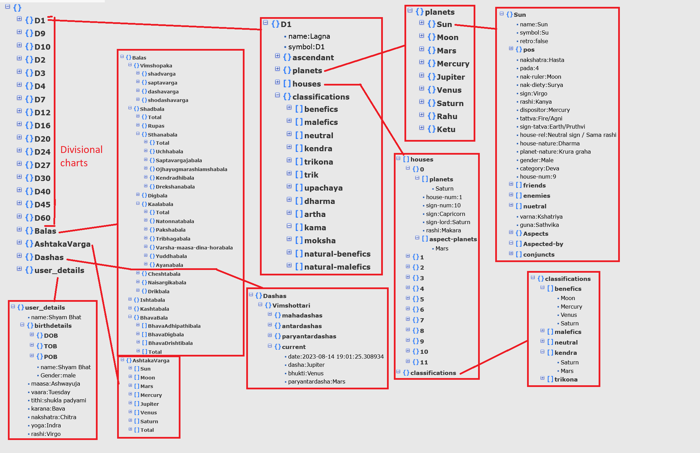

# Jyoti**shyam**itra is a tool for indian vedic astrology based software

## This tool takes the below mentioned birthdata and computes astrological data useful for a astrologer and astrology tool developer. You can use the data to further develop your own tool and anything else you want.

Birthdata Needed
- Name
- Gender
- DOB (Date of birth)
- POB (Place of birth - Longitude and lattitude and timezone (GMT) of the place)
- TOB (Time of birth in 24 hour format till seconds)


# The APIs provided by this module are explained below

## The APIs related to input for the module. 
### The API to provide input birthdata : `input_birthdata`
> input_birthdata to be used to provide input birthdata with below parameters.
>
> Input parameters all must be strings (Even numbers must be provided as strings)
>
> Parameters as below:
>> - **name** : its the name of the person whose astrological data you want to compute
>> - **gender** : This is gender of the person. *"male"* , *"female"* and *"others"* are the options
>> - **year** : this is the birth year of the person. it must be given in 4 digit format as a string ex: "1992"
>> - **month** : This is birth month of the person. you can either provide month number in string like "3" for March. Or else you can use the constants like *jyotishyamitra.September* Constants for All 12 months are provided. 
>> - **day** :This is the day part of date when the person was born. it also needs to be number provided as string like  "31" if the person is born on 31st of some month and year. 
>> - **hour** : This is hour part of birth time of the person. It is 24 hour format to be provided as string. ex: for 3 PM the value for hour will be "15" and for 3 AM it will be "3"
>> - **min** : This is minute part of birth time of the person. It is  to be provided as string. ex: for 3.25 the value for min will be "25".
>> - **sec** : This is seconds part of birth time of the person. This is not mandatory. if not provided it will take value of 0seconds. It is to be provided as string and only if you know exact second of birth time. ex: for 3.25.16 the value for min will be "16".
>> - **place** : This is the place name where the person was born. this also is a string. ex: "Honavar"
>> - **longitude** : This is the longitude of the birthplace. This is in Decimal degree format. For East the value will be positive number and for West it will be negative number. For example Honavar longitude is **74.4439° E** and so longitude value will be **"74.4439"**. Also if the Longitude of a place is **70° W 30'** then first convert 30 minutes to degrees which is 0.5 degrees. and since its west it will be negative. So longitude value will be **"-70.5"** in string format as you can see here. 
>> - **lattitude** : This is the lattitude of the birthplace. This is in Decimal degree format. The format is similar to longitude but here for North the value will be positive number and for South it will be negative number. For example Honavar lattitude is **14.2798° N** and so lattitude value will be **"14.2798"** in string format as you can see here. 
>> - **timezone** : This is the GMT tiezone value in decimal hour format. For example the timezone of Honavar is **GMT + 5 hr 30 min** and so the value of timezone will be **"+5.5"**. And for newyork the timezone is **GMT - 4 hr** and so the timezone value would be **"-4.0"** in string format as you can see here.
>
>This API returns the dictionary with all the provided input data till that point.

You can call this API to provide the input data in a single shot as shown below:
```python
#Providing birthdata of the person
inputdata = jyotishyamitra.input_birthdata(name="Shyam Bhat", gender="male", year="1991", month=jyotishyamitra.October, day="8", hour="14", min="47", sec="9", place="Honavar", longitude="+74.4439", lattitude="+14.2798", timezone="+5.5")

print(inputdata)
```

Alternatively you can provide the birthdata in multiple calls as shown below:
```python
#providing Name and Gender
inputdata = jyotishyamitra.input_birthdata(name="Shyam Bhat", gender="male")

#providing Date of birth details
inputdata = jyotishyamitra.input_birthdata(year="1991", month="10", day="8")

#Providing Place of birth details
inputdata = jyotishyamitra.input_birthdata(place="Honavar", longitude="+74.4439", lattitude="+14.2798", timezone="+5.5")

#Providing Time of birth details
inputdata = jyotishyamitra.input_birthdata(hour="14", min="47", sec="9")

print(inputdata)

```

---

### The API to clear input birthdata : `clear_birthdata`

This API is used to clear the birth data given previously. It returns the structure of birthdata which will be empty. 
It is highly recommended to call this API before providing fresh birth data using API `input_birthdata()`.

```python
#Clearing previlous input data to have a fresh start
inputdata = jyotishyamitra.clear_birthdata()

print(inputdata)

#Providing fresh birthdata of the person
inputdata = jyotishyamitra.input_birthdata(name="Shyam Bhat", gender="male", year="1991", month=jyotishyamitra.October, day="8", hour="14", min="47", sec="9", place="Honavar", longitude="+74.4439", lattitude="+14.2798", timezone="+5.5")

print(inputdata)

```
---

### The API to validate input birthdata : `validate_birthdata`
This API is used to validate all the birthdata provided using API `input_birthdata`. 
If any of birth data is not provided then this API shall provide that in string format. Or if any parameter format is wrong then also it returns that error in strong format.
If all the input birth datas are proper then this API returns "SUCCESS". Only after the data is validated then the input data can be used for further processing.

---

### The API to check if input birthdata is validated: `IsBirthdataValid`
This API is used to check if the input data is validated or not and if if its valid. Its return value is *boolean*
> Retrun value meanings
> - True: Input birthdata is validated and is Valid. 
>
> - False: Either the input birth data is not validated (API `validate_birthdata` is not called). If validated then birthdata is not valid.

---

### The API to get input birthdata after it is validated: `get_birthdata`
This API is used to get the input data as a dictionary once it is validated. This API returns the input birthdata if its validated successfully. If birthdata is not validated then this API returns `None`

---
---

## The APIs related to output for the module. 
### The API to provide output file destination and name : `set_output`
This API allows the user to provide a existing destination path and name of output json file in which the astrological data would be saved.
This API takes 2 parameters as input:
1. **path** : This should be the destination path where the output file has to be saved in the computer. The folder seperator must be "\\"(backslash). and at the end of folder there should not be any back-slash symbol. The this parameter given is invalid path then the API returns that error and the output path is not set.
2. **filename** : This is the name of the file without the extension. If this parameter is not provided then by default the name **astrodata** would be given to the file. 

If the output path and file name are set successfully then this function returns "SUCCESS". 
Example usage of this API is shown below:

```python
#To create D:\Project\jyotishyamitra\astroOutput.json.
#Note that Folder location D:\Project\jyotishyamitra must already exist in the system for this API to work. 
status = jyotishyamitra.set_output(path="D:\Project\jyotishyamitra", "astroOutput")

print(status)
```
---

### The API to get output json file full name with location : `get_output`
This API gives you full location of the generated json file with astrological data.
Always make sure that this APIn is called only after `set_output` is called to set the destination first. 
Below the example code to demonstrate the usage of the API is given

```python
 
status = jyotishyamitra.set_output(path="D:\Project\jyotishyamitra", "astroOutput")
if (status == "SUCCESS"):
    print(jyotishyamitra.get_output())
#This results in output : 'D:\Project\jyotishyamitra\astroOutput.json'

```

---
---

## The APIs related to astrological data generation 
### The API to generate Astrological data from birthdata given and save it in output file in json format `generate_astrologicalData`

This is the most important API of this module. This API takes valid birthdata which is returned by API `get_birthdata` after the input data is validated as input and computes the astrological data based on indian vedic astrology and siderial ayanamsha and nirayana method and stores all those computed astrological data in json format in the file created in the location set by API `set_output` 

This API takes 1 input parameter : 
- birthdata: This is the dictionary of all the provided birth data which can be fetched by calling the API `get_birthdata`

**Return Value** : This API returns the **full name of json file** which contains computed astrological data along with its location as its output if the API is executed successfully.

> **Note** : If input birth data is not provided properly and not validated successfully before calling this API then it returns **"INPUT_ERROR"** and doesnt compute any astrological data. Similarly if output path is not provided using API `set_output` before calling this API then it returns **"OUTPUTPATH_ERROR"** and doesnt compute any astrological data as well. 

> Below listed astrological data are computed by this module
> - User Details like name, rashi, nakshatra, vaara, tithi, karana, maasa etc along with birth details
> - Lagna chart components ascendant, planets and their sign, house, nakshatra, nakshatra lord, their friends, enemies etc
> - All 16 Varga chart details and vargottama 
> - functional and natural benefics and malefics in the chart
> - Different planetery balas like vimshopaka bala, Shadbala and their sub divisions
> - Strengths of houses - BhavaBalas and their sub divisions (Adhipathi bala, Digbala and drishti bala)
> - AshtakaVarga - Bhinna Ashtakavarga of all 7 planets from Sun to Saturn and Sarvashtaka varga
> - and many many more....
>
> To clearly understand all the various astrological data computed in detail refer to section of Astrological Datas.

---
---

# Order of API invocation to compute Astrological data of a person

Below Steps have to be followed in API invocation to get the Astrological data properly. 
1. Clear the past input data residue by calling `clear_birthdata`
2. Provide input birth data by calling `input_birthdata` in a single shot or multiple steps. Make sure all the input birth data is provided.
3. Validate the input data by calling `validate_birthdata`
4. Check if birthdata is valid using API `IsBirthdataValid` and if yes then get the **birthdata** by calling `get_birthdata`. This return value of API `get_birthdata` is important and store this birthdata dictionary in a variable which will be passed as input variable in next steps to compute astrological data. 
5. Provide the location and filename for output file where computed astrological data would be stored by invoking API `set_output`. Make sure this API returns `'SUCCESS'` to make sure the location provided is proper.
6. Invoke `generate_astrologicalData` with input parameter **birthdata** we had fetched in step 4 as input parameter to this api. The return value is the output json file with its location where the astrological data are generated. 
7. If you want to fetch the output file full name (path with name) then you can also get it by invoking `get_output` API. 
Hence the Astrological data is computed for given birth data in json file format. 

### Below code snippet demonstrates the steps provided above :

```python
import jyotishyamitra as jsm

#step 1 :clear past input data
jsm.clear_birthdata()

#Step 2: Providing input birth data - here multiple times the API input_birthdata are invoked but you can do it in single shot too.
#providing Name and Gender
inputdata = jsm.input_birthdata(name="Shyam Bhat", gender="male")

#providing Date of birth details
inputdata = jsm.input_birthdata(year="1991", month=jsm.October, day="8")

#Providing Place of birth details
inputdata = jsm.input_birthdata(place="Honavar", longitude="+74.4439", lattitude="+14.2798", timezone="+5.5")

#Providing Time of birth details
inputdata = jsm.input_birthdata(hour="14", min="47", sec="9")

#Step 3: Validate Birthdata
jsm.validate_birthdata()

#Step 4: If Birthdata is valid then get birthdata
if(jsm.IsBirthdataValid()):
    birthdata = jsm.get_birthdata()


#Step 5: Set the output folder and name of file to save generated astrological data
if("SUCCESS" == jsm.set_output(path="D:\OutFolder", filename="astroOutput")):
    #Step 6: Computing Astrological data
    jsm.generate_astrologicalData(birthdata)    #Compute the astrological data based on new set.
    print(f'The output is : {jsm.get_output()}')    #step 7: to get output file full name
else:
    print("Given folder path doesnt exist")
    

```

---
---

# The Contents of Astrological Data stored in output JSON file:

The below image shows the various Astrological Data generated by this module:


## The sections in Generated output JSON file


